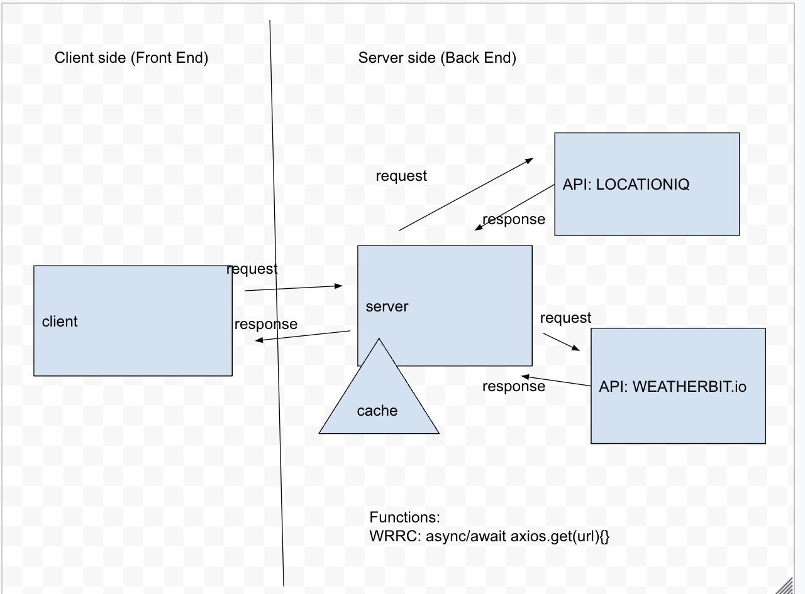
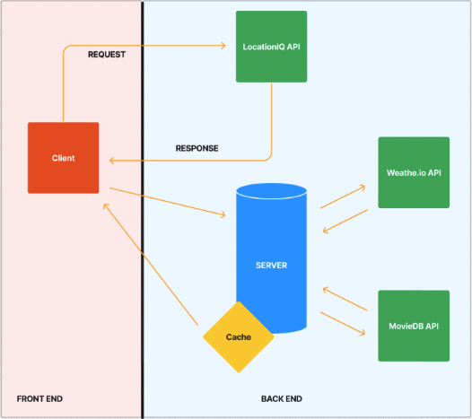
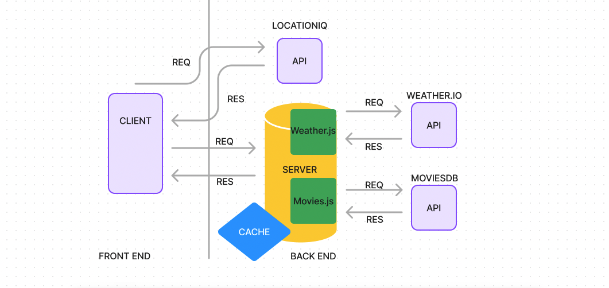
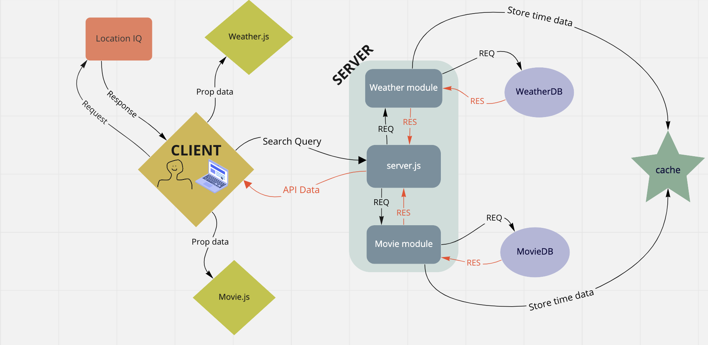

# City-Explorer App

## Web request-response 

* 

* 

* 

* 

* 

## Time Estimmates

Name of feature: Create City Explorer app, api, and read me

Estimate of time needed to complete: 5hrs

Start time: 1430

Finish time: 2350

Actual time needed to complete: 9hrs

----

Name of feature: added weather and forecast

Estimate of time needed to complete: 5hrs

Start time: 1430

Finish time: 2130

Actual time needed to complete: 7hrs

----

Name of feature: backend, react repo, spi keys

Estimate of time needed to complete: 5hrs

Start time: 1430

Finish time: 2300

Actual time needed to complete: 9hrs

----

Name of feature: created weather/movies component displaying day weather and movies for city searched

Estimate of time needed to complete: 5hrs

Start time: 1300

Finish time: 1600

Actual time needed to complete: 3hrs

----

Name of feature: lab10 debugging

Estimate of time needed to complete: 5hrs

Start time: 1600

Finish time: 2330

Actual time needed to complete: 7 1/2 hours

